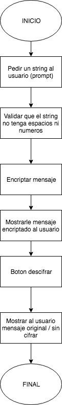

# CIFRADO CÉSAR

### Descripción:

Crea una web que pida, por medio de un prompt(), una frase al usuario y devuelva el mismo mensaje encriptado según el algoritmo de Cifrado César con el parámetro de desplazamiento de 33 espacios hacia la derecha.

## Pseudocódigo

### Descripción

En esta parte se describe la funcionalidad del proyecto a través de los siguientes pasos

1. Pedir un string al usuario

2. Validar que el input no tenga espacios vacíos, que el string solo contenga letras

3. Cifrar el string según el algoritmo de Cifrado César. Formula: (x + n) % 26) con el parámetro de desplazamiento de 33 espacios hacia la derecha.

4. Mostrarle mensaje encriptado al usuario

5. Darle al usuario la opción de descifrar mensaje

6. Mostrar al usuario mensaje original / sin cifrar

#### Validaciones:

- Cifrar y descifrar mayúsculas como minúsculas
- No dejar pasar campos vaciones o números.

#### Consideraciones Específicas:

- Debe tener dos funciones: cipher y decipher

## Diagrama de Flujo

### Descripcion

